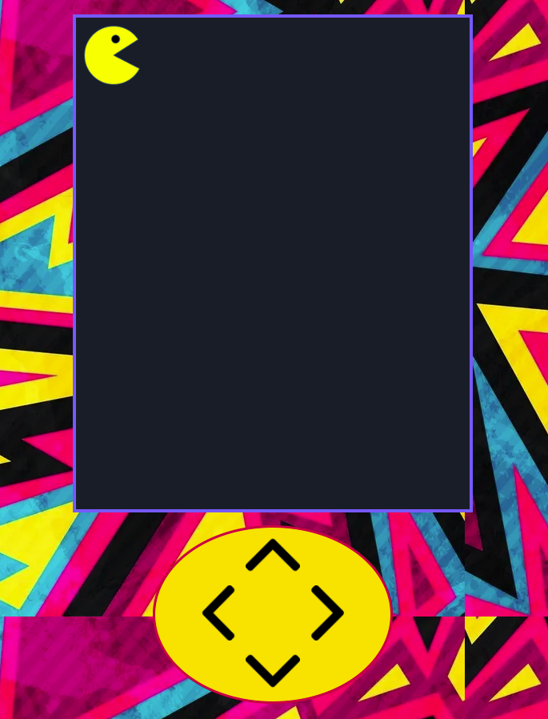

 
  

&#xa0;

  <!-- <a href="https://flower.netlify.app">Demo</a> -->

<h1 align="center">PacMan</h1>

<!-- Status -->

<!-- <h4 align="center">
	🚧  Flower 🚀 Under construction...  🚧
</h4>

 -->

  <a href="#dart-about">About</a> &#xa0; | &#xa0; 
  <a href="#rocket-technologies">Technologies</a> &#xa0; | &#xa0;
  <a href="#white_check_mark-requirements">Requirements</a> &#xa0; | &#xa0;
  <a href="#memo-license">License</a> &#xa0; | &#xa0;
  <a href="https://github.com/arturomsoberanes" target="_blank">Author</a>

 

## :dart: About

PacMan game made with HTML, CSS and JavaScript.

### Demo

[Click here](https://arturomsoberanes.github.io/pacman/)

## :rocket: Technologies

The following tools were used in this project:

- [HTML](https://whatwg.org/)
- [CSS](https://www.w3.org/Style/CSS/Overview.en.html)
- [JavaScript](https://www.ecma-international.org/)

## :white_check_mark: Requirements

You don't need anything extra to play

## :memo: License

This project is under license from GNU. For more details, see the [LICENSE](LICENSE) file.

Made with :heart: by <a href="https://github.com/arturomsoberanes" target="_blank">arturomsoberanes</a>

&#xa0;

<a href="#top">Back to top</a>
